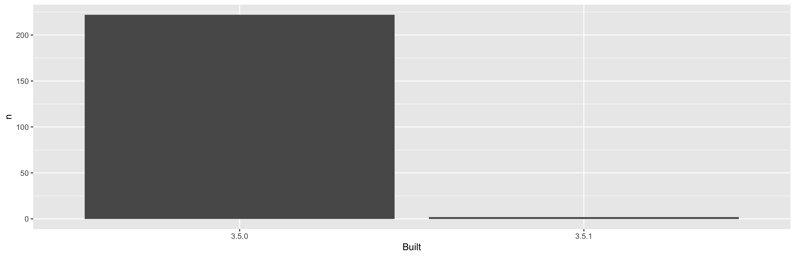

<!-- README.md is generated from README.Rmd. Please edit that file -->

```{r setup, include = FALSE}
knitr::opts_chunk$set(
  collapse = TRUE,
  comment = "#>"
)
library(tidyverse)
```

# packages-report

The goal of packages-report is to show the state of the R packages installed on the machine.

```{r, include = FALSE}
## load data/add-on-packages-freqtable.csv here in this chunk
pk <- readr::read_csv(here::here("data", "add-on-packages-freqtable.csv"))
```

I have `r sum(pk$n)` add-on packages installed.

Here's how they break down in terms of which version of R they were built under, which is related to how recently they were updated on CRAN.

```{r, echo = FALSE}
knitr::kable(pk)
```




